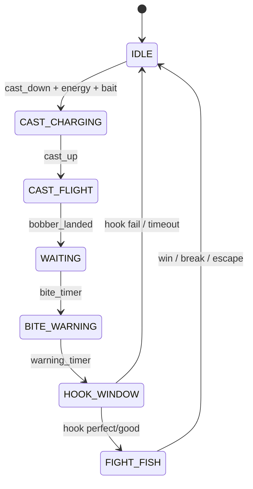

# Игровой кодекс — «Клёвое место: Новая эра»

**Версия:** 2.0.0  
**Платформа:** браузер (mobile-first), DOM + CSS + JavaScript  
**Архитектура:** event-driven FSM, единый RNG pipeline, JSON-конфиги

---

## 1. Обзор

Игра — рыболовная RPG без физического движка. Вся механика строится на **конечном автомате состояний (FSM)** и **событийной шине**. Визуал поплавка — исключительно DOM + CSS-анимации; canvas используется только для фона озера и спрайта удочки.

### 1.1 Игровой цикл

```
IDLE → CAST_CHARGING → CAST_FLIGHT → WAITING → BITE_WARNING → HOOK_WINDOW → FIGHT_FISH → (награда / провал) → IDLE
```

### 1.2 Модули

| Модуль | Файл | Ответственность |
|--------|------|-----------------|
| Конфиг | `public/data/game-config.js` | Баланс, редкости, тайминги, паттерны рыбы |
| События | `public/js/core/events.js` | `GameEvents`, константы `EV.*` |
| RNG | `public/js/core/rng.js` | Случайность, weighted tables, bite wait |
| FSM | `public/js/core/fsm.js` | `enter` / `update` / `exit`, переходы |
| Снасти | `public/js/systems/gear.js` | Модификаторы удочки, крючка, наживки, удачи |
| Поведение рыбы | `public/js/systems/fish-behavior.js` | Паттерны idle/burst/recovery/escape/feint |
| Бой | `public/js/systems/fight.js` | Натяжение, выносливость, green zone |
| Экономика | `public/js/systems/economy.js` | Серебро, опыт, кривая апгрейдов |
| Контроллер | `public/js/fishing-controller.js` | Связка FSM + систем |
| UI поплавка | `public/js/ui/bobber-ui.js` | DOM-состояния анимации |
| UI рыбалки | `public/js/ui/fishing-ui.js` | Шкалы, подсечка, статусы |
| Данные рыб/локаций | `public/data.js`, `apk-data.js` | Контентные таблицы |
| Оркестратор | `public/game.js` | Canvas, HUD, магазин, сохранения |

---

## 2. FSM — конечный автомат

### 2.1 Состояния

| Состояние | Вход (`enter`) | Обновление (`update`) | Выход (`exit`) | Переходы |
|-----------|----------------|----------------------|----------------|----------|
| **IDLE** | Скрыть поплавок, сброс UI | — | — | `CAST_START` → CAST_CHARGING |
| **CAST_CHARGING** | Показать индикатор силы | Нарастание `castPower` при удержании | Эмит `CAST_RELEASE` | Отпускание / таймаут → CAST_FLIGHT |
| **CAST_FLIGHT** | Выбор рыбы (RNG), полёт поплавка | Tween позиции (CSS/DOM) | — | Поплавок на точке → WAITING |
| **WAITING** | `bobber--idle`, таймер поклёвки | Fake movement по интервалу | — | `waitElapsed ≥ waitSec` → BITE_WARNING |
| **BITE_WARNING** | `bobber--warning`, вибрация UI | Таймер 0.5–2 с | — | Таймер истёк → HOOK_WINDOW |
| **HOOK_WINDOW** | `bobber--bite`, бегущий маркер | Движение маркера, таймаут окна | Скрыть окно подсечки | Клик: PERFECT/GOOD → FIGHT_FISH; FAIL/таймаут → IDLE |
| **FIGHT_FISH** | Старт FightSystem | Hold/release, паттерны рыбы | Скрыть fight UI | win → награда; break/escape → IDLE |

### 2.2 Диаграмма



### 2.3 Контракт состояния

```javascript
GameFSM.register('STATE_NAME', {
  enter(ctx, payload) {},  // инициализация при входе
  update(ctx, dt, time) {}, // dt — кадры (≈1 при 60 FPS)
  exit(ctx, payload) {},    // очистка при выходе
});
```

Переходы **только** через `GameFSM.transition(next, payload)` или события шины. Прямое изменение `ctx` из UI допустимо только для флагов ввода (`holding`).

---

## 3. Поплавок (DOM, без физики)

Поплавок — `#bobber`, позиционируется в `%` от `#game-app`. **Никакой физики воды.**

### 3.1 Анимационные состояния

| Класс | Назначение | Реализация |
|-------|------------|------------|
| `bobber--idle` | Статичное ожидание | Лёгкий float keyframe |
| `bobber--fake` | Ложное движение | CSS animation 1.2 с |
| `bobber--warning` | Предклёв | Shake + tint |
| `bobber--bite` | Клёв / бой | Tween translateY + scale |

Переключение: `BobberUI.setState('warning')`.

### 3.2 Fake movement

В `WAITING` каждые 4–9 с (конфиг `fakeBobberIntervalSec`) с вероятностью запускается `fake` на ~1.2 с, затем возврат в `idle`. Не влияет на RNG поклёвки.

---

## 4. RNG Pipeline

Единая точка случайности — `GameRNG`. Все системы используют её, не `Math.random()` напрямую.

### 4.1 Время до поклёвки

```
waitSec = random(min, max)
min = max(2, biteWaitMinSec - biteBonus × 2)
max = max(min + 1, biteWaitMaxSec - biteBonus × 8)
```

Модификатор `biteBonus` = удочка (tier) + наживка + крючок × 0.5.

Дополнительно: сила заброса `castPower` сокращает ожидание на до 15%:  
`waitSec × (1.05 - castPower × 0.15)`.

### 4.2 Выбор рыбы (weighted table)

Для локации `L` с `fishIds[]` и `fishVer[]`:

```
weight(fish_i) = fishVer[i] × (1 + biteBonus)
entry = pickWeighted(table)
```

Редкость базовая: `rarityByCategory[fish.category]`.

### 4.3 Апгрейд редкости

```
boost = rareBonus + hookRarityBonus + luck × 0.02
if random() < boost  → rarity +1 tier
if random() < boost × 0.35 → ещё +1 tier (cap: legendary)
```

### 4.4 Вес рыбы

```
weight = minW + random() × (maxW - minW), округление до 3 знаков
```

---

## 5. Подсечка (HOOK_WINDOW)

### 5.1 Окно реакции

Длительность: `random(hookWindowMinSec, hookWindowMaxSec)` (0.8–1.4 с).

Маркер бежит по шкале 0→1 с переменной скоростью. Игрок жмёт кнопку в момент прохождения маркера.

### 5.2 Оценки

| Grade | Условие (позиция маркера) | catchBonus | Влияние |
|-------|---------------------------|------------|---------|
| **PERFECT** | ≤ 12% | ×1.25 | +15% к апгрейду редкости |
| **GOOD** | ≤ 28% | ×1.0 | +5% к редкости |
| **FAIL** | > 28% или таймаут | ×0 | Рыба уплыла |

Конфиг: `GAME_CONFIG.hookGrades`.

---

## 6. Вываживание (FIGHT_FISH)

### 6.1 Шкалы

| Шкала | Диапазон | Поражение |
|-------|----------|-----------|
| **Tension** (натяжение) | 0–100% | ≥ 100% → леска порвалась |
| **Stamina** (выносливость рыбы) | 0–staminaMax | ≤ 0 → победа |

### 6.2 Управление

- **Удержание** кнопки: натяжение растёт (`holdTensionRate` − `tensionControl`).
- **Отпускание**: натяжение падает (`releaseTensionRate`).
- **Green zone** (32–72%, расширяется от `stability` и `tensionControl`): в зоне при паттернах idle/recovery/feint — урон по stamina.

### 6.3 Паттерны рыбы

| Паттерн | tensionMod | staminaRegen | Длительность (кадры) |
|---------|------------|--------------|----------------------|
| idle | +0.3 | +0.12 | 40–80 |
| burst | +1.8 | 0 | 18–35 |
| recovery | −0.5 | +0.2 | 30–55 |
| escape | +2.2 | 0 | 12–22 |
| feint | +0.1 | +0.15 | 25–40 |

При `burst` / `escape` удержание кнопки опасно — натяжение растёт быстрее.  
При `escape` и натяжении < 12% — рыба срывается.

### 6.4 Фазы по редкости

| Редкость | fightPhases | feintChance |
|----------|-------------|-------------|
| Common | 1 | 0.1 |
| Uncommon | 1 | 0.1 |
| Rare | 2 | 0.1 |
| Epic | 3 | 0.25 |
| Legendary | 4 | 0.35 |

Каждый `burst`/`escape` увеличивает `phaseIndex`; легендарные рыбы чередуют фазы с обманным затишьем (`feint`).

---

## 7. Редкость

| ID | Метка | weightMul | rewardMul | fightPhases |
|----|-------|-----------|-----------|-------------|
| common | Обычная | 1.0 | 1.0 | 1 |
| uncommon | Необычная | 1.2 | 1.3 | 1 |
| rare | Редкая | 1.5 | 1.8 | 2 |
| epic | Эпическая | 2.0 | 2.5 | 3 |
| legendary | Легенда | 3.0 | 4.0 | 4 |

Маппинг из APK-категорий: `rarityByCategory` в `game-config.js`.

---

## 8. Предметная система

### 8.1 Удочки (tiers 1–5)

Уровень удочки из магазина → tier: `ceil(level / 2)`, cap 5.

| Tier | biteBonus | rareBonus | tensionControl | stability |
|------|-----------|-----------|----------------|-----------|
| 1 | 0 | 0 | 0 | 0 |
| 2 | 0.05 | 0.03 | 0.05 | 0.05 |
| 3 | 0.10 | 0.06 | 0.10 | 0.10 |
| 4 | 0.16 | 0.10 | 0.15 | 0.14 |
| 5 | 0.22 | 0.15 | 0.22 | 0.20 |

### 8.2 Крючок и наживка

- **Крючок:** `bonus` → biteBonus × 0.5, rareBonus полностью.
- **Наживка:** `bonus` → biteBonus, расход 1 за заброс.

### 8.3 JSON-схема предмета (расширение)

```json
{
  "id": "rod_3",
  "type": "rod",
  "name": "Спиннинг Pro",
  "level": 5,
  "tier": 3,
  "modifiers": {
    "biteBonus": 0.1,
    "rareBonus": 0.06,
    "tensionControl": 0.1,
    "stability": 0.1
  },
  "price": 1200,
  "currency": "silver"
}
```

Новые предметы добавляются в `SHOP` (`data.js`) без изменения кода систем.

---

## 9. Локации

```json
{
  "id": "0",
  "name": "Лесная Речка",
  "level": 1,
  "region": "Центральная Россия",
  "fishIds": [1, 2, 3],
  "fishVer": [10, 5, 2],
  "modifiers": {
    "biteBonus": 0,
    "difficulty": 1.0
  }
}
```

- `fishVer` — вес в weighted table (чем выше, тем чаще клюёт).
- `difficulty` — множитель `fish.diff` в бою (опционально).
- Локация фильтрует доступных рыб; весь RNG pipeline получает `location` + `modifiers` игрока.

---

## 10. Экономика

### 10.1 Награда за улов

```
silver = round(weight × price × 4 × rewardMul[rarity] × catchBonus)
exp = floor(expBase × weight × 10 × catchBonus × perfectBonus)
```

`perfectBonus` = 1.5 при PERFECT подсечке.

### 10.2 Апгрейды

```
cost(level) = basePrice × upgradeCostCurve^(level - 1)
```

`upgradeCostCurve` = 1.65 (замедление прогресса).

### 10.3 Ресурсы игрока

| Поле | Назначение |
|------|------------|
| silver | Основная валюта |
| gold | Премиум (магазин) |
| exp / level | Прогресс персонажа |
| energy | 5 за заброс, реген 1/5 с |
| luck | Бонус к редкости (база 5 + level × 0.5) |
| inventory | Наживка, крючки |

---

## 11. Event Bus

| Событие | Payload | Когда |
|---------|---------|-------|
| `state:enter` | `{ state, from, ctx }` | Вход в состояние FSM |
| `state:exit` | `{ from, to, ctx }` | Выход из состояния |
| `cast:start` | `{ ctx }` | Начало заряда |
| `cast:release` | `{ power }` | Отпускание заброса |
| `bite:warning` | `{ ctx }` | BITE_WARNING |
| `bite:hook` | `{ ctx }` | HOOK_WINDOW открыт |
| `hook:result` | `{ grade, ctx }` | Оценка подсечки |
| `fight:tick` | `{ ctx, result }` | Каждый кадр боя |
| `catch:complete` | `{ fish, rewards }` | Успешный улов |

Подписка: `GameEvents.on(EV.FIGHT_WIN, handler)`.

---

## 12. UI (mobile-first)

| Элемент | ID | Поведение |
|---------|-----|-----------|
| Кнопка заброса | `#cast-btn` | pointerdown/up — заряд / подсечка / тяга |
| Сила заброса | `#cast-power-wrap` | Ширина fill = castPower |
| Поплавок | `#bobber` | CSS-состояния |
| Окно подсечки | `#hook-window` | Маркер + зоны perfect/good |
| Натяжение | `#tension-fill`, `#tension-green` | Green zone overlay |
| Выносливость | `#stamina-fill` | Обратная шкала HP рыбы |
| Статус | `#fishing-status` | Текстовые подсказки |

Все оверлеи рыбалки в `#fishing-ui` с `pointer-events: none`, кроме интерактивных дочерних.

---

## 13. Сохранение

Сервер: `PUT /api/save` — `{ player, discountEnd, tutorialSeen }`.

Поля `player` для механики: `gear`, `inventory`, `level`, `luck`, `catches`, `locationId`.

---

## 14. Расширение контента (чеклист)

1. Добавить рыбу в `FISH` / `apk-data.js` с `category`, `minW`, `maxW`, `diff`, `price`.
2. Указать `fishIds` / `fishVer` в локации.
3. При необходимости — новый tier удочки в `GAME_CONFIG.rodTiers`.
4. Новый паттерн — запись в `fishPatterns` + ветка в `FishBehavior.pickPattern`.
5. Подписаться на `GameEvents` для аналитики или достижений.

---

## 15. Порядок загрузки скриптов

```
apk-data.js → data.js → game-config.js
→ events.js → rng.js → fsm.js
→ gear.js → fish-behavior.js → fight.js → economy.js
→ bobber-ui.js → fishing-ui.js
→ fishing-controller.js → rod-sprites.js → auth.js → game.js
```

---

## 16. Принципы разработки

1. **Без физики** — только предзаданные анимации и таймеры.
2. **Детерминированные переходы FSM** — никаких скрытых флагов состояния вне `ctx`.
3. **Один RNG** — тестируемость через `GameRNG.setSeed(n)`.
4. **JSON-first** — баланс в `GAME_CONFIG`, контент в `data.js`.
5. **Модульность** — новая механика = новая система + регистрация в FSM, не правки монолита.

---

*Документ является единым источником правды для дальнейшей разработки, балансировки и масштабирования проекта.*
